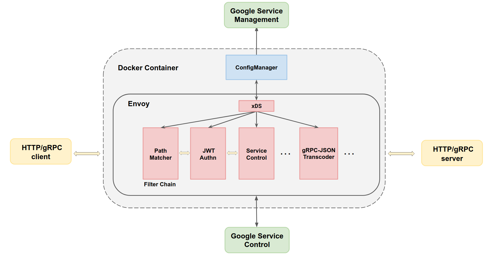

# Google Cloud Platform ESPv2

Google Cloud Platform ESPv2 is a general-purpose L7 service proxy that enables API management
capabilities for JSON/REST or gRPC API services. ESPv2 integrates with Google Service
Infrastructure to provide policy checks and telemetry reports.

ESPv2 is the next iteration of [ESP](https://github.com/cloudendpoints/esp/).
The current implementation of ESPv2 uses [Envoy](https://www.envoyproxy.io/) as a service proxy.

## Table of Contents

* [Introduction](#introduction)
* [Features](#features)
* [Getting Started](#getting-started)
* [ESPv2 Releases](#espv2-releases)
* [ESPv2 vs ESP](#espv2-vs-esp)
* [Repository Structure](#repository-structure)
* [Contributing and Support](#contributing-and-support)
* [License](#license)
* [Disclaimer](#disclaimer)

## Introduction

Google Cloud Endpoints and ESPv2 provide:

* **Easy Adoption**: The API service can be implemented in any coding language using any IDLs.

* **Multiple Deployment Modes**: Deploy ESPv2 as a sidecar for local backends or as a reverse proxy for remote backends.

* **Platform Flexibility**: Support the deployment on any cloud or hybrid environment.

* **Superb Performance and Scalability**: ESPv2 has low latency and high throughput.

ESPv2 includes two components:

* Config Manager: Control plane to configure the Envoy proxy
* Envoy: Data plane to process API requests/responses

Config Manager configures the data plane's Envoy filters dynamically via the
[Google Service Management API](https://cloud.google.com/service-infrastructure/docs/service-management/reference/rest/)
and flags specified by the API producer.

Envoy (with our custom filters) handles API calls using [Service Infrastructure](https://cloud.google.com/service-infrastructure/docs/overview),
Google's foundational platform for creating, managing, and consuming APIs and services.

## Features

ESPv2 provides powerful enterprise-ready features, such as:

* [Multiple Authentication Methods](https://cloud.google.com/endpoints/docs/openapi/authentication-method):
Authenticate applications using API Keys. Authenticate users using any authentication platform that conforms
to JSON Web Token [RFC 7519](https://tools.ietf.org/html/rfc7519). This includes Firebase Authentication,
Auth0, Okta, Google ID tokens, and Google Service Accounts.

* [Quotas and Rate Limiting](https://cloud.google.com/endpoints/docs/openapi/quotas-overview):
Control the rate at which applications can call your APIs.

* [gRPC Transcoding](https://cloud.google.com/endpoints/docs/grpc/transcoding):
Allow clients to use HTTP/JSON to call backends that only support gRPC. ESPv2 will map HTTP/JSON requests
(and their parameters) to gRPC methods (and their parameters and return types).

* [API Telemetry](https://cloud.google.com/endpoints/docs/grpc/monitoring-your-api):
Monitor API metrics such as error rates, response latencies, request size, etc. on Google Cloud Platform.
ESPv2 also writes access logs for each request, providing insight into HTTP headers and response codes.

* [Application Observability](https://cloud.google.com/endpoints/docs/grpc/tracing):
Understand and debug problems with your API or ESPv2 by viewing traces and application logs.

* Multi Transport Protocols: ESPv2 supports HTTP/1.1, HTTP/2, web sockets, gRPC and gRPC-web.

* Security: ESPv2 supports TLS for downstream and upstream, also mTLS for upstream connections, for both HTTP and gRPC.

* Dynamic Routing: When deployed on non-serverless platforms (GCE, GKE, K8S) as a sidecar, ESPv2 routes all traffic
to a single local backend. When deployed on serverless platforms (Cloud Run) as a reverse proxy, ESPv2 can route traffic 
across multiple remote upstream services.

* Health Checks: ESPv2 can actively monitor your services.

## Getting Started

The official Google Cloud Endpoints documentation contains tutorials and detailed documentation
on deploying ESPv2 and managing API traffic.

Getting started with Extensible Service Proxy V2(ESPv2) tutorials:

* [Cloud Endpoints for OpenAPI](https://cloud.google.com/endpoints/docs/openapi/tutorials)

* [Cloud Endpoints for gRPC](https://cloud.google.com/endpoints/docs/grpc/tutorials)

Configuring ESPv2:

* [ESPv2 Startup Options](https://cloud.google.com/endpoints/docs/openapi/specify-esp-v2-startup-options)

Understanding ESPv2:

* [Architecture](doc/architecture.md)

* [Use Cases](doc/use-cases.md)

## ESPv2 Releases

ESPv2 is released as two docker images:

* For sidecar mode with local backends: [gcr.io/endpoints-release/endpoints-runtime:2](https://gcr.io/endpoints-release/endpoints-runtime:2)
* For reverse proxy mode with remote backends: [gcr.io/endpoints-release/endpoints-runtime-serverless:2](https://gcr.io/endpoints-release/endpoints-runtime-serverless:2)

## ESPv2 vs ESP

ESPv2 is the next iteration of [ESP](https://github.com/cloudendpoints/esp/).
Instead of an nginx-based data plane, ESPv2 uses [Envoy](https://www.envoyproxy.io/).
See the [architecture overview](doc/architecture.md) for more info on ESPv2.

ESPv2 is designed to be *mostly backwards-compatible* with ESP (with the exception of a few startup flags).
API producers do not need to modify the Endpoints Service Configuration to use ESPv2.
Please refer to the [migration guide](https://cloud.google.com/endpoints/docs/grpc/migrate-to-esp-v2)
for more details on the incompatible changes.

For serverless reverse proxy deployments, it is recommended to use ESPv2 instead of ESP.
For sidecar deployments, either ESPv2 or ESP can be used, but ESPv2 will receive more features.

## Repository Structure

* [api](api): Envoy Filter Configurations developed in ESPv2

* [doc](doc): Extended documentation (tutorials, architecture, use cases, etc.)

* [docker](docker): Scripts for packaging ESPv2 in a Docker image for releases

* [examples](examples): Examples to configure ESPv2

* [prow](prow): Prow based test automation scripts

* [scripts](scripts): Scripts used for build and release ESPv2

* [src](src): ESPv2 source code, including Envoy Filters and Config Manager

* [tests](tests): Integration and end-to-end tests for ESPv2

* [tools](third_party/tools): Assorted tooling

## Contributing and Support

Please join the [google-cloud-endpoints](https://groups.google.com/forum/#!forum/google-cloud-endpoints)
Google group for announcements on ESPv2.

If you need support from the ESPv2 engineering team:

* For issues using ESPv2 with Google Cloud Endpoints, post in the Google Group.
* For feature requests and bug reports specific to the ESPv2 codebase, file a Github Issue.

Your contributions are welcome:

* Please follow the [contributor guidelines](CONTRIBUTING.md).
* Refer to the [developer guide](DEVELOPER.md) for details on building and testing ESPv2.

## License

[Apache v2](LICENSE) - Google LLC

## Disclaimer

ESPv2 is currently GA for both sidecar and reverse proxy deployment modes.
