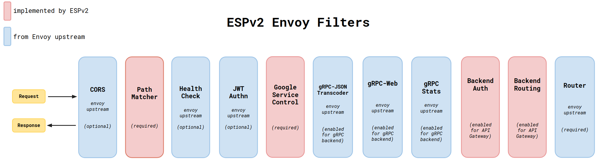

# Architecture Overview

The main [README.md](../README.md) explains that Config Manager configures the ESPv2 data plane (Envoy).
More information about Config Manager is located in the [src/go](../src/go/README.md) directory.

ESPv2 uses a variety of Envoy filters. These filters are either:

* Upstream HTTP filters in the [Envoy repository](https://www.envoyproxy.io/docs/envoy/latest/api-v2/config/filter/http/http).
* Custom HTTP filters located in the [src/envoy](../src/envoy/README.md) directory of this repository.

The diagram below displays all the filters used by ESPv2.
Note that only a few are required, the remaining are enabled based on the deployment mode.

You can find more details about each custom filter in the corresponding directories.