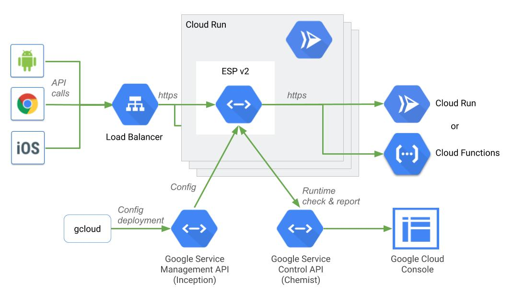
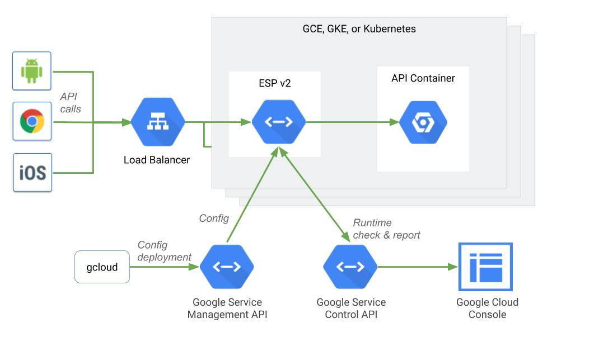

# Use Cases

Google Cloud Endpoints and ESPv2 enable both API Gateway and sidecar deployment modes.

The diagram below displays ESPv2 deployed as an API Gateway on Google Cloud Run.

The diagram below displays ESPv2 deployed as a sidecar for Kubernetes.
The sidecar deployment mode is not officially support by ESPv2 yet.

